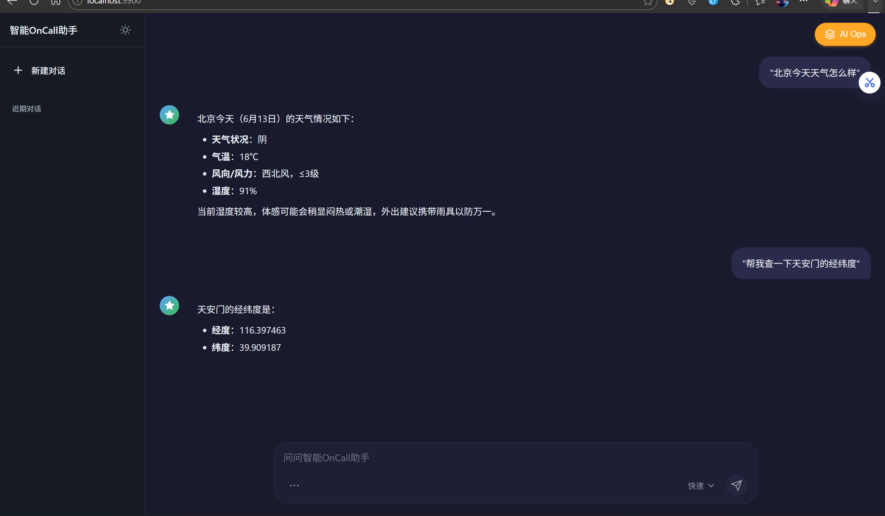
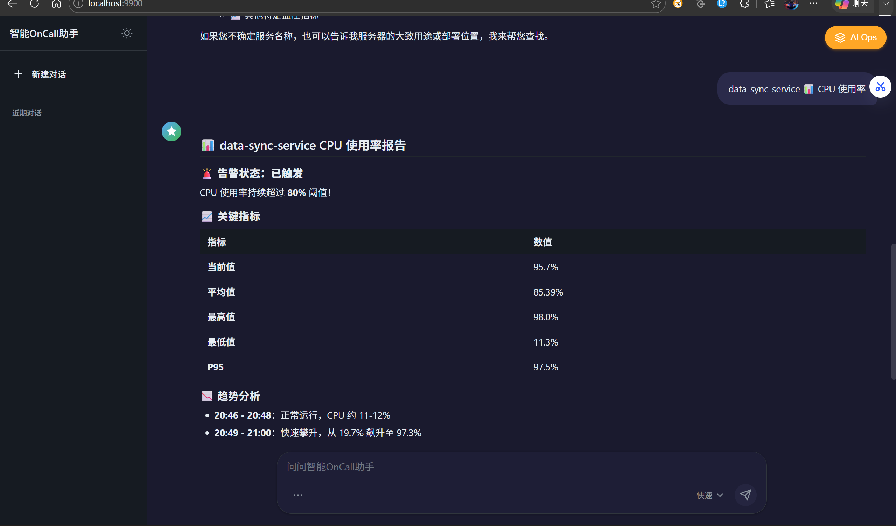
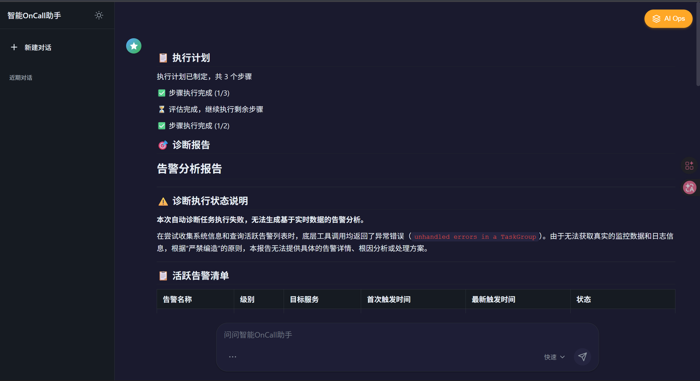
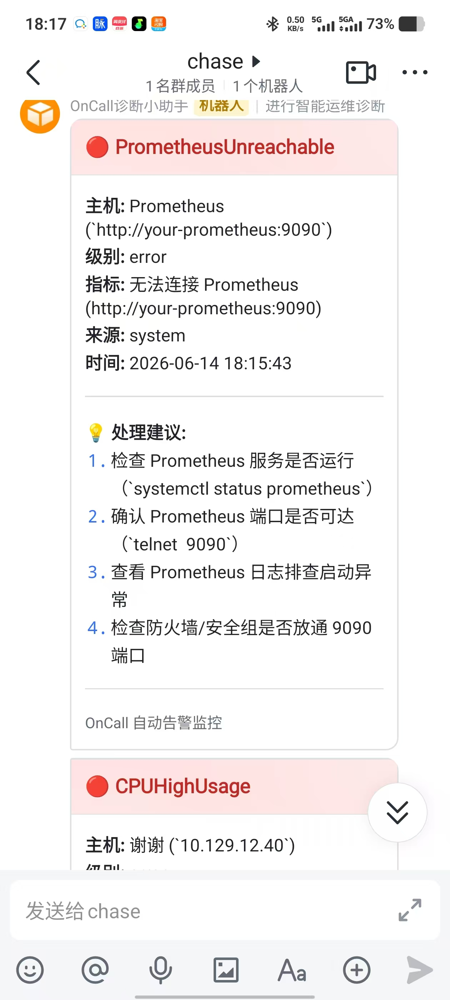
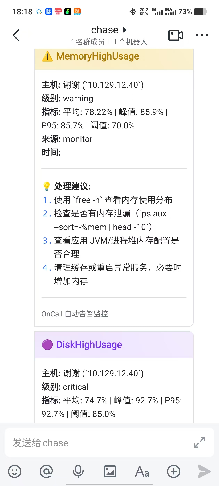
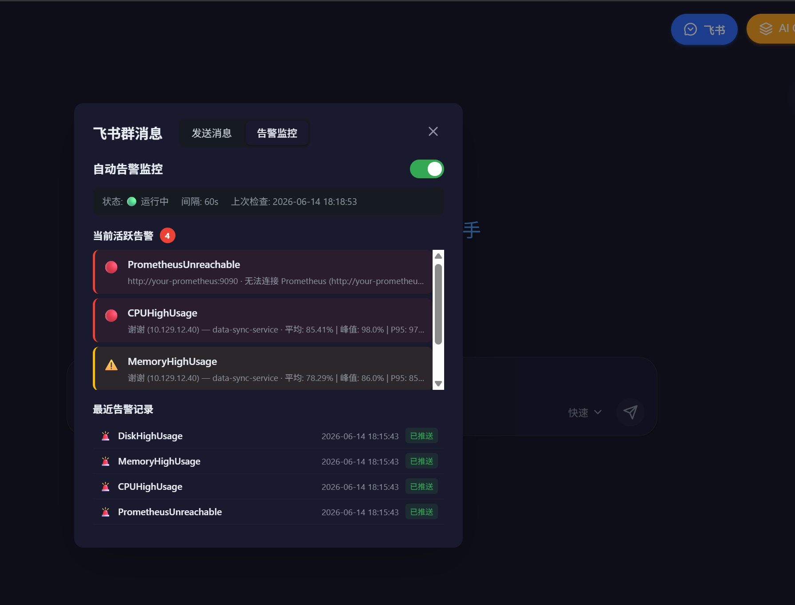

# OnCall

> 智能运维助手：把日志查询和监控诊断的活交给 Agent 去跑，我在旁边喝茶。

[](https://www.python.org/)
[](https://fastapi.tiangolo.com/)
[](https://www.langchain.com/)
[](https://langchain-ai.github.io/langgraph/)
[](https://milvus.io/)
[](LICENSE)

## 📖 项目简介

OnCall 是一个面向运维团队的对话式 Agent 系统，接入了日志平台和 Prometheus 监控数据，让大模型能直接帮你查日志、看指标、诊断故障。主要能力包括：

### 1. RAG 智能问答

集成 Milvus 向量数据库和阿里云 DashScope，上传运维文档后 Agent 基于文档回答问题，问不到的内容拒绝编造。支持多轮对话、流式输出和混合检索（稠密 + 稀疏 RRF 融合）。

### 2. AIOps 智能运维

基于 LangGraph 的 **Planner → Executor → Replanner** 多 Agent 协作模式。给定一个告警，Agent 自动制定排查计划、调用 MCP 工具搜索日志和监控数据、输出结构化诊断报告（根因分析 + 关键证据 + 运维建议）。

### 3. 扩展能力

除知识库问答与运维诊断外，Agent 还可按需调用：**Prometheus 指标查询**、**腾讯云 CLS 日志检索**、**高德地图（地理编码 / 路线规划 / 天气）** 等 MCP 工具；同时支持 **飞书告警推送** 与 **飞书告警面板**。

界面与典型用法见 **[📸 功能演示与使用截图](#-功能演示与使用截图)**。

## 🚀 核心特性

- ✅ **RAG 问答**: 混合检索（稠密 + BM25 稀疏） + Rerank 精排 + 多轮对话 + SSE 流式输出
- ✅ **AIOps 诊断**: Plan-Execute-Replan 三阶段，SSE 实时推送每一步执行状态
- ✅ **MCP 工具协议**: CLS 日志、Monitor 监控、高德地图各自是独立 MCP Server，Agent 通过 MCP Client 调用，换数据源不改 Agent 代码
- ✅ **飞书集成**: 告警实时推送到飞书群 + 飞书告警面板查看监控数据
- ✅ **上下文压缩**: 自写中间件，QwenTokenizer 精确计数 → 超 70% 窗口触发压缩 → 失败降级 trim 截断
- ✅ **会话持久化**: SQLite 存储（AsyncSqliteSaver），服务重启会话不丢失
- ✅ **速率限制**: 按端点分级（对话 10/min、流式 5/min、AIOps 3/min），防 API 额度刷光
- ✅ **多格式文档**: Markdown 三段切分、PDF（pdfplumber）、Word（python-docx），新增格式只需加一个 Handler
- ✅ **检索降级链**: 重排服务挂了 → 单文档跳过 → API 异常回退 → 全局开关关闭

## 📸 功能演示与使用截图

启动后访问 **http://localhost:9900**。截图位于仓库 [`static/imgs/`](static/imgs/)。

| # | 功能 | 截图 |
|---|------|------|
| 1 | 首页对话 | [homepage.png](static/imgs/homepage.png) |
| 2 | 高德地图 MCP | [amap-mcp.png](static/imgs/amap-mcp.png) |
| 3 | 腾讯云 CLS MCP | [cls-mcp.png](static/imgs/cls-mcp.png) |
| 4 | AIOps 诊断 | [aiops-diagnosis.png](static/imgs/aiops-diagnosis.png) |
| 5 | 飞书告警推送 | [feishu-alert-1.jpg](static/imgs/3b586ed2ef6624b10f26e8e60915056a.jpg) |
| 6 | 飞书告警推送 | [feishu-alert-2.jpg](static/imgs/aeca0e4840de0097997387881057994d.jpg) |
| 7 | 飞书告警面板 | [feishu-panel.png](static/imgs/68e4ae34b530bf51f10b8d93c81264fe.png) |

---

### 1. 首页对话

Web 对话界面，支持流式输出、多轮上下文、工具调用结果展示。


**使用**：启动后浏览器打开 `http://localhost:9900`，在输入框直接提问。请求体字段 **`Id`** 为会话 ID。

---

### 2. 高德地图 MCP

通过高德 MCP Server 实现地理编码、路线规划、天气查询等功能。Agent 根据用户自然语言问题自动选择合适的地图工具。



**示例提问**：「从北京到杭州应该怎么走？」「附近有什么餐厅？」

**前置**：需前往 [高德开放平台](https://lbs.amap.com/) 申请 API Key，配置 `AMAP_API_KEY` 环境变量。

---

### 3. 腾讯云 CLS MCP

通过腾讯云 CLS MCP Server 查询线上日志，Agent 可根据时间范围、关键词等条件检索日志并分析。



**示例提问**：「查询 CPU 使用率」「帮我查下 data-sync-service 的日志」

**前置**：配置 `MCP_CLS_URL` 指向 CLS MCP 服务地址。

---

### 4. AIOps 智能诊断

顶部点击「AIOps 诊断」，Agent 自动拉取 Prometheus 告警 → 制定排查计划 → 调用工具查日志/监控 → 输出结构化诊断报告。全程 SSE 流式推送，可看到每一步执行状态。



**API**：`POST /api/aiops`（SSE），见 [AIOps 诊断流程](#aiops-诊断流程)。

---

### 5. 飞书告警推送

告警信息实时推送到飞书群，支持磁盘/内存/监控链路等多种告警类型。成员在手机上可收到飞书通知栏提醒（需开启飞书通知权限）。

| 飞书群告警消息 | 飞书群告警详情 | 飞书告警面板 |
|---|---|---|
|  |  |  |

**前置**：配置飞书自定义机器人 Webhook，见 [告警推送配置](#告警推送)。

---

## 📚 功能使用指南

以下功能均可在 **Web 聊天框**（`http://localhost:9900`）用自然语言提问，Agent 会自动选择工具。请求体中的会话字段为 **`Id`**。

### RAG 知识库问答

**知识来源**

| 来源 | 说明 |
|------|------|
| `aiops-docs/` | 启动时上传，全会话可见 |
| `POST /api/upload` | 会话内上传，可选隔离 |

**示例提问**

- 「生产环境 CPU 飙高怎么排查？」
- 「磁盘快满了怎么处理？」
- 「我们的监控系统架构是什么？」

**上传文档**

```bash
curl -X POST http://localhost:9900/api/upload \
  -F "file=@运维手册.md"
```

支持格式：`md, txt, pdf, docx`。新增文件类型只需加一个 Handler 类，注册到 HandlerRegistry，不用改已有代码。

### 查询监控数据

**示例提问**

- 「现在服务器 CPU 和内存占用多少？」
- 「Prometheus 有哪些活跃告警？」
- 「最近 1 小时 QPS 趋势怎么样？」

Agent 会调用相应的 MCP 工具查询 Prometheus 指标。

### AIOps 智能运维

见 [AIOps 诊断流程](#aiops-诊断流程) 和 [API 调用示例](#调用示例)。

### 地图与天气

通过高德 MCP Server 实现地理编码、路线规划、天气查询。需配置 `AMAP_API_KEY`。

**示例提问**

- 「从北京到杭州应该怎么走？」
- 「北京明天天气怎么样？」

未指定城市时 Agent 默认倾向 **合肥**。

---

## 🛠️ 技术选型

| 层 | 选型 | 为什么 |
|---|---|---|
| 框架 | FastAPI + SSE | 诊断流程可能要跑几十秒，必须流式输出，不能让前端干等。 |
| 模型 | Qwen-Max (DashScope) | OpenAI 兼容协议，切模型不需要改代码。温度设 0.7，诊断时降为 0 降低幻觉。 |
| Agent 编排 | LangGraph | LangChain AgentExecutor 工具调用失败后不会重试，排查流程没法中途调整。换了 LangGraph 状态图，Plan → Execute → Replan 三阶段，每一步都能 inspect。 |
| 工具协议 | MCP | 工具和 Agent 之间用 MCP 解耦。CLS 日志、Monitor 监控、高德地图各自是独立 MCP Server，Agent 通过 MCP Client 调用。后面换数据源，Agent 代码不用改。 |
| 向量库 | Milvus 2.3+ | 支持稠密+稀疏混合检索。一开始只用了 COSINE 相似度，关键词匹配场景效果不好，补了 BM25 稀疏向量做 RRF 融合。 |
| 重排序 | qwen3-rerank | 粗排召回 10 条 → 精排取 Top 3。相似度 < 0.5 直接丢弃，避免拿不相关文档去问模型。重排服务挂了有降级：单文档跳过 → API 异常回退 → 全局开关关闭。 |
| 会话存储 | SQLite (AsyncSqliteSaver) | 最早用 MemorySaver，服务重启对话全丢。迁移到 SqliteSaver 后会话持久化，`data/oncall_sessions.db` 一个文件搞定。 |
| 速率限制 | slowapi | 按端点分级，因为 DashScope API 是付费的，不加限制一个死循环能把额度刷光。 |
| 上下文压缩 | 自写中间件 | LangChain 内置的 SummarizationMiddleware 依赖模型 profile 属性，Qwen 没有。自己写了个 before_model 中间件：QwenTokenizer 精确计数 → 超过 70% 窗口触发压缩 → 失败降级 trim 截断。 |

## 📦 核心模块

```
OnCall/
├── app/
│   ├── main.py                        # FastAPI 入口，lifespan 里连 Milvus 初始化 BM25
│   ├── config.py                      # 全部配置项 + 默认值（Pydantic Settings）
│   ├── api/                           # 路由层，只做参数校验和响应格式化
│   │   ├── chat.py                    #   POST /api/chat, /api/chat_stream, DELETE /api/chat/clear
│   │   ├── aiops.py                   #   POST /api/aiops  SSE 流式诊断
│   │   ├── file.py                    #   POST /api/upload  文档上传入库
│   │   └── health.py                  #   GET  /api/health
│   ├── services/                      # 业务逻辑
│   │   ├── rag_agent_service.py       #   Agent 核心：create_agent + 中间件 + 工具注册
│   │   ├── aiops_service.py           #   Plan-Execute-Replan 诊断流程编排
│   │   ├── context_compressor.py      #   上下文压缩中间件（自实现）
│   │   ├── document_splitter_service.py # 文档切分：Markdown 三阶段 / PDF / Word
│   │   ├── vector_embedding_service.py  # 稠密 (text-embedding-v4) + 稀疏 (BM25)
│   │   ├── vector_index_service.py      # Milvus 索引管理 + Schema 迁移
│   │   ├── vector_search_service.py     # 混合检索：稠密 + 稀疏 RRF 融合 → 重排序
│   │   └── vector_store_manager.py      # Collection 生命周期管理
│   ├── agent/                         # Agent 专属模块
│   │   ├── mcp_client.py              #   MCP 多服务客户端（单例 + 指数退避重试）
│   │   └── aiops/                     #   Plan-Execute-Replan 三节点
│   │       ├── planner.py             #     查询知识库经验 → 生成诊断步骤
│   │       ├── executor.py            #     逐步执行，失败传错误给 Replanner
│   │       ├── replanner.py           #     评估结果，决定继续/调整/出报告
│   │       ├── state.py               #     状态 TypedDict 定义
│   │       └── utils.py               #     工具描述格式化
│   ├── core/                          # 基础设施
│   │   ├── llm_factory.py             #   ChatQwen 实例工厂
│   │   ├── milvus_client.py           #   Milvus 连接管理（单例）
│   │   └── rate_limiter.py            #   slowapi 包装器
│   ├── models/                        # Pydantic 请求/响应模型
│   └── utils/
│       └── logger.py                  # Loguru 配置：按天轮转 + 控制台彩色输出
├── static/                            # 前端：纯 HTML + vanilla JS + CSS
│   ├── index.html
│   ├── app.js
│   ├── styles.css
│   └── imgs/                          #   界面截图
├── mcp_servers/                       # MCP 工具服务（独立进程）
│   ├── cls_server.py                  #   日志查询服务 (FastMCP)
│   ├── monitor_server.py              #   监控数据服务 (Prometheus)
│   └── amap_server.py                 #   高德地图服务 (地理编码/路径规划/天气)
├── aiops-docs/                        # 运维知识库 Markdown 文档
├── data/                              # 运行时数据（SQLite 会话库等）
├── logs/                              # Loguru 日志输出
├── uploads/                           # 上传文件临时目录
├── volumes/                           # Milvus 数据持久化
├── .env.example                       # 环境变量模板
├── Makefile                           # Linux/macOS 项目管理
├── start-windows.bat                  # Windows 启动脚本
├── stop-windows.bat                   # Windows 停止脚本
├── vector-database.yml                # Milvus Docker Compose
├── pyproject.toml                     # 依赖 + black/ruff/mypy/pytest 配置
└── README.md
```

## 📡 核心接口

### 接口总览

| 方法 | 路径 | 说明 | 限流 |
|---|---|---|---|
| POST | `/api/chat` | 普通对话，一次性返回 | 10/min |
| POST | `/api/chat_stream` | 流式对话，SSE | 5/min |
| POST | `/api/aiops` | AIOps 诊断，SSE 流式 | 3/min |
| POST | `/api/upload` | 上传文档到知识库 | 20/min |
| DELETE | `/api/chat/clear` | 清空指定会话历史 | - |
| GET | `/api/health` | 健康检查 | - |

### 调用示例

**普通对话**

```bash
curl -X POST "http://localhost:9900/api/chat" \
  -H "Content-Type: application/json" \
  -d '{"Id":"session-001","Question":"生产环境 CPU 飙高怎么排查？"}'
```

**流式对话（推荐）**

```bash
curl -X POST "http://localhost:9900/api/chat_stream" \
  -H "Content-Type: application/json" \
  -d '{"Id":"session-001","Question":"帮我查下最近的错误日志"}' \
  --no-buffer
```

**AIOps 诊断**

```bash
curl -X POST "http://localhost:9900/api/aiops" \
  -H "Content-Type: application/json" \
  -d '{"session_id":"session-001"}' \
  --no-buffer
```

**上传文档**

```bash
curl -X POST "http://localhost:9900/api/upload" \
  -F "file=@运维手册.md"
```

SSE 事件类型：`content`（文本片段）、`tool_call`（工具调用开始/结束）、`search_results`（检索结果）、`done`（完成）、`error`（错误）。

---

## ⚙️ 核心配置

所有配置项通过 `.env` 文件管理，有默认值的可以省略。

### 必填

```bash
# DashScope API Key（阿里云百炼平台注册获取：https://dashscope.aliyun.com/）
DASHSCOPE_API_KEY=sk-your-key-here

# 如果用国内站点，需要指定（默认走新加坡）
DASHSCOPE_API_BASE=https://dashscope.aliyuncs.com/compatible-mode/v1
DASHSCOPE_MODEL=qwen-max
```

### Milvus

```bash
MILVUS_HOST=localhost
MILVUS_PORT=19530
```

### RAG 检索

```bash
RAG_TOP_K=10                  # 粗排召回条数
RAG_SCORE_THRESHOLD=0.5       # 相似度过滤阈值
RERANK_ENABLED=true           # 重排序开关
RERANK_TOP_N=3                # 精排保留条数
HYBRID_SEARCH_ENABLED=true    # 混合检索开关（稠密+稀疏）
```

### 文档分块

```bash
CHUNK_MAX_SIZE=800
CHUNK_OVERLAP=100
```

### 上下文压缩

```bash
CONTEXT_COMPRESSION_ENABLED=true
CONTEXT_COMPRESSION_TRIGGER_FRACTION=0.7  # 达到窗口 70% 触发压缩
```

### 会话持久化

```bash
CHECKPOINT_DB_PATH=data/oncall_sessions.db
```

### 速率限制

```bash
RATE_LIMIT_ENABLED=true
RATE_LIMIT_CHAT=10/minute
RATE_LIMIT_CHAT_STREAM=5/minute
RATE_LIMIT_AIOP=3/minute
RATE_LIMIT_UPLOAD=20/minute
```

### MCP 服务地址

```bash
MCP_CLS_URL=http://localhost:8003/mcp
MCP_MONITOR_URL=http://localhost:8004/mcp
MCP_AMAP_URL=http://localhost:8005/mcp
```

### 高德地图

```bash
# 前往 https://lbs.amap.com/ 申请 Key
AMAP_API_KEY=your-amap-key
```

### Prometheus

```bash
PROMETHEUS_BASE_URL=http://localhost:9090
```

---

## 🚀 快速开始

### 1. 环境准备

- Python 3.11+
- [Docker Desktop](https://www.docker.com/products/docker-desktop/)（跑 Milvus 用）
- [DashScope API Key](https://dashscope.aliyun.com/)（阿里云百炼平台注册就能拿）

```bash
# 环境变量
export DASHSCOPE_API_KEY=your-api-key
```

### 2. 启动应用

**Linux / macOS：**

```bash
git clone <your-repo-url>
cd OnCall

# 装依赖（推荐 uv，比 pip 快一个数量级）
pip install uv
uv venv && source .venv/bin/activate
uv pip install -e .

# 编辑 .env，填上你的 DASHSCOPE_API_KEY
cp .env.example .env
vim .env

# 一键初始化（拉 Docker 镜像 + 启 Milvus + 启服务 + 上传文档）
make init

# 后续启动只需
make start
```

**Windows（PowerShell）：**

```powershell
git clone <your-repo-url>
cd OnCall

# 装依赖
pip install uv
uv venv
.venv\Scripts\activate
uv pip install -e .

# 编辑 .env，填 DASHSCOPE_API_KEY
notepad .env

# 方式一：一键脚本
.\start-windows.bat

# 方式二：手动一步步起（方便排查问题）
# 终端1：启动 Milvus
docker compose -f vector-database.yml up -d

# 终端2：启动日志 MCP 服务
python mcp_servers/cls_server.py

# 终端3：启动监控 MCP 服务
python mcp_servers/monitor_server.py

# 终端4：启动高德地图 MCP 服务
python mcp_servers/amap_server.py

# 终端5：启动主服务
python -m uvicorn app.main:app --host 0.0.0.0 --port 9900

# 上传知识库文档（主服务起来后再跑）
python -c "import requests, os; [requests.post('http://localhost:9900/api/upload', files={'file': open(f'aiops-docs/{f}', 'rb')}) for f in os.listdir('aiops-docs') if f.endswith('.md')]"
```

### 3. 访问

| 地址 | 内容 |
|---|---|
| http://localhost:9900 | Web 对话界面 |
| http://localhost:9900/docs | Swagger API 文档 |

### 4. 命令行验证

```bash
# 健康检查
curl http://localhost:9900/api/health

# 上传文档
curl -X POST http://localhost:9900/api/upload -F "file=@文档.md"

# 智能问答
curl -X POST http://localhost:9900/api/chat \
  -H "Content-Type: application/json" \
  -d '{"Id":"test","Question":"磁盘快满了怎么办？"}'
```

---

## AIOps 诊断流程

基于 LangGraph 的 **Plan-Execute-Replan** 模式，完整流程：

```
用户发起诊断
    ↓
1. Planner — 查知识库找相关运维经验 → 分析有什么工具可用 → 生成 4~6 步诊断计划
    ↓
2. Executor — 逐步执行计划，调用 MCP 工具（查日志、拉 Prometheus 指标）
    ↓       ← 失败？传错误信息给 Replanner
3. Replanner — 评估当前结果，决定：继续下一步 / 调整剩余计划 / 直接生成报告
    ↓
4. 输出结构化诊断报告（根因分析 + 关键证据 + 运维建议）
```

保护机制：
- 最多 8 步，超过 5 步后禁止重规划，防止无限循环。
- Executor 单步失败不中断，错误信息传给 Replanner 判断要不要重试。
- 整个过程 SSE 流式推给前端，能看到每一步的执行状态。

参与的工具（Planner / Executor 共用）：

| 工具 | 作用 |
|------|------|
| CLS 日志查询 | 检索线上日志 |
| Prometheus 指标查询 | 拉取 CPU/内存/QPS 等监控数据 |
| Prometheus 告警查询 | 查询活跃告警规则 |
| 知识库检索 | 检索运维处置文档 |
| 高德天气 | 天气信息（AIOps 流程中一般不用，但已注册） |

---

## 知识库支持的文件类型

| 类型 | 处理方式 |
|---|---|
| `.md` | Markdown 三段切分：按标题切 → 长段落递归切 → 碎片合并（保证 chunk 在 800 字以内且不切断句子） |
| `.txt` | 按段落 + 长度切分 |
| `.pdf` | pdfplumber 提取文本后切分 |
| `.docx` | python-docx 提取文本后切分 |

新增文件类型只需加一个 Handler 类，注册到 HandlerRegistry，不用改已有代码。

---

## 告警推送

OnCall 内置后台告警监控服务（`alert_monitor.py`），定时通过 Monitor MCP 检查 CPU / 内存 / 磁盘指标，同时查询 Prometheus 活跃告警。检测到新告警后通过飞书 MCP（端口 8007）自动推送卡片消息到指定飞书群，告警恢复时也会推送通知。

### 监控范围

| 告警类型 | 来源 | 条件 |
|---------|------|------|
| CPU 使用率过高 | Monitor MCP | CPU 超阈值 |
| 内存使用率过高 | Monitor MCP | 内存超阈值 |
| 磁盘使用率过高 | Monitor MCP | 磁盘超阈值 |
| Prometheus 告警 | Prometheus API | Prometheus firing 告警 |
| Prometheus 不可达 | 系统 | 无法连接 Prometheus |

### 飞书推送

飞书配置存储在 `mcp_servers/feishu_config.json`（已 gitignore），包含飞书应用凭证和群聊信息。告警推送使用飞书卡片消息，按严重程度（critical / error / warning / info）显示不同颜色和标题。

> 请勿将飞书凭证提交到 GitHub 或公开博客；若泄露请在飞书后台重置。

---

## 💡 常见问题

### Windows 相关

| 现象 | 处理 |
|------|------|
| `make` 命令不可用 | 使用 `.\start-windows.bat` 替代 |
| PowerShell 脚本执行报错 | `Set-ExecutionPolicy -ExecutionPolicy RemoteSigned -Scope Process`，或直接用 CMD 跑 `.bat` |
| 端口被占用 | `netstat -ano \| findstr :9900` 查占用，`taskkill /F /PID <PID>` 释放 |

### 通用问题

| 现象 | 处理 |
|------|------|
| DashScope API Key 报错 | 确认 `.env` 里填了 key（不是示例值）：`cat .env \| grep DASHSCOPE_API_KEY` |
| Milvus 连不上 | 确保 Docker Desktop 在运行：`docker ps \| grep milvus`；没有就 `docker compose -f vector-database.yml up -d`；起来了还连不上，重启 standalone 容器 |
| 知识库文档搜不到 | 确认 Milvus 已启动 + 文档已上传（`make upload` 或手动 `POST /api/upload`） |
| 上下文太长被截断 | 检查 `CONTEXT_COMPRESSION_ENABLED` 和 `CONTEXT_COMPRESSION_TRIGGER_FRACTION` 配置 |
| 服务启动失败想查日志 | 主服务：`tail -f logs/app_$(date +%Y-%m-%d).log`；MCP：`tail -f mcp_cls.log` / `tail -f mcp_monitor.log` |

---

## 📄 License

MIT

---

**版本**: v1.0.0
**许可证**: MIT
